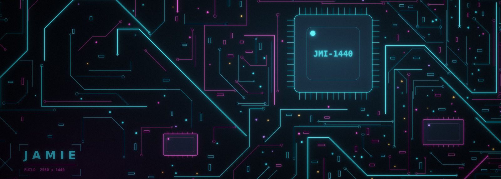
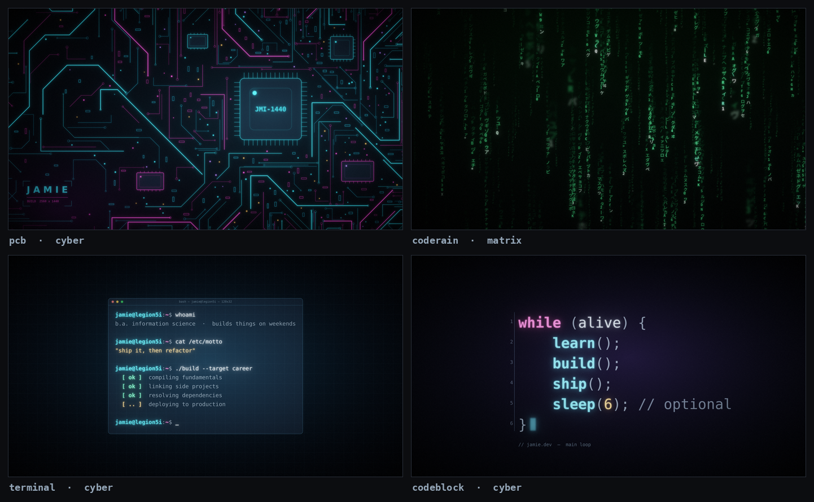
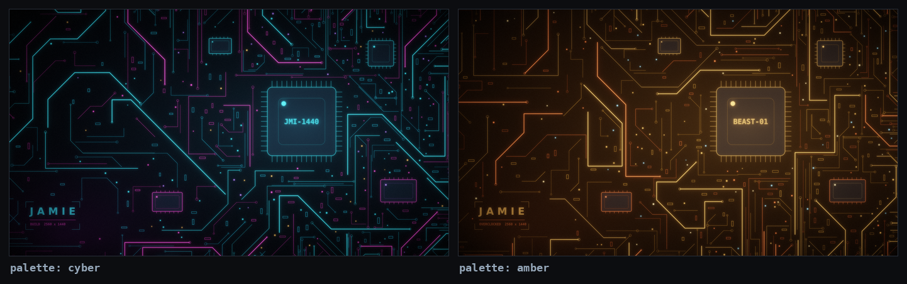
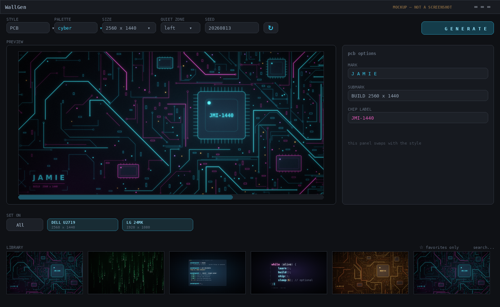

<div align="center">



# WallGen

**Procedural desktop wallpapers for Windows.** Generate them, keep them, set a different one on every monitor.

<!-- Update the license badge if you pick something other than MIT. -->


</div>

---

Every wallpaper is drawn from scratch by a seeded generator — no image models, no stock
photos, nothing downloaded. A wallpaper is fully described by a handful of parameters
and an integer seed, which means any wallpaper you've ever made can be reproduced
exactly, or re-cut for a different screen, months later.

It exists because I got tired of cropping 4K wallpapers to fit an ultrawide and watching
the interesting part end up off-screen.

## Styles



| Style | What it draws |
|---|---|
| `pcb` | A circuit board. Traces are routed against an occupancy grid so no two ever cross, which is what makes it read as real copper instead of a laser grid. Chips, pin rows, solder points, optional silkscreen wordmark. |
| `coderain` | Four depth planes of falling katakana and ASCII, with the foreground plane thrown out of focus and random cell dropouts so columns flicker instead of reading as solid strings. |
| `terminal` | A glowing shell session in a window. The session text is a small plain-text DSL, so it says whatever you want. |
| `codeblock` | A snippet as large syntax-highlighted typography, with an editor gutter and a cursor block. |

Six palettes — `cyber`, `amber`, `matrix`, `violet`, `ice`, `crimson` — and every style
picks all of them up.



## Install

Requires Windows 10/11 and [uv](https://docs.astral.sh/uv/).

```bash
git clone https://github.com/YOUR-USERNAME/wallgen.git
cd wallgen
uv sync
uv run wallgen
```

<!-- Delete this paragraph until you've actually published a release, or the link 404s. -->
Or grab `WallGen.exe` from [Releases](../../releases) if you'd rather not have Python
installed. Windows SmartScreen will warn about the unsigned binary once — *More info →
Run anyway*.

## Using it

<!-- Swap this for a real screenshot once the window exists — and consider a short GIF of
     pressing the re-roll button a few times, which sells the app better than any still. -->


<sub>Mockup of the planned layout — the real thing doesn't exist yet.</sub>

1. Pick a style, palette, and size. Connected monitors show up as one-click sizes.
2. **Generate.** You get a fast half-size preview first, then the full render lands behind it.
3. Don't like the layout? Hit **⟳** next to the seed. Same style, completely different composition.
4. **Set on** → all monitors, or one specific monitor.

Everything you generate is saved to the library automatically, with its full parameter
set. Double-click a library item to load it back into the controls, or right-click →
*Re-render at…* to produce the same design at a different resolution.

### Quiet zones

One edge of every wallpaper is deliberately kept darker and less busy so your desktop
icons stay readable. `left` is the default and suits Windows; use `top` for phone
wallpapers, or `none` for a screen with no icons on it.

### Command line

The engine is a library with a CLI on top, so you can skip the GUI entirely:

```bash
uv run wallgen render --style pcb --size 3440x1440 --palette amber \
    --mark "J A M I E" --chip-label "BEAST-01" --seed 771402 --out wall.png

uv run wallgen render --style terminal --script session.txt --user "me@desktop"
uv run wallgen list          # every size preset, palette, and style
```

A terminal session file looks like this:

```
$ whoami
a person who builds things
$ ./build --target today
[ok] compiling fundamentals
[..] deploying to production
$
```

## How it works

Three ideas do most of the work.

**One unit, every constant.** Every hand-tuned number in the engine is expressed in
units of *one pixel at 1440p*, and scaled by `min(width, height) / 1440` at render
time. A 4K render is therefore the same design drawn larger, not a denser one, and a
phone render recomposes rather than stretching — trace counts scale with area, code-rain
columns scale with how many glyph widths fit across the frame, and text sizes derive
from the longest line.

**Rejection-based layout.** The PCB style doesn't place traces, it *tries* to. Each
candidate path is rasterized into a coarse occupancy grid and thrown away if it touches
anything already drawn. The board self-organizes as a result: dense where there's room,
sparse where there isn't, and no two traces ever cross.

**The seed is the artifact.** Renders aren't stored as "an image I happened to make."
The library stores the full parameter set as JSON, and the PNG is a cache of it. That's
what makes `at(3440, 1440)` a real feature instead of an upscale.

Everything finishes through the same pipeline: multi-radius bloom (tight, mid, and wide
Gaussians added separately), a filmic highlight rolloff so bright areas bloom instead of
clipping to flat white, then film grain. That last stage is most of why the output
doesn't look like a flat vector drawing.

Per-monitor wallpapers go through the `IDesktopWallpaper` COM interface rather than the
legacy `SystemParametersInfoW` call, which can only set one image everywhere.

## Project layout

```
wallgen/
├─ engine/        pure render — no Qt, no win32, no disk writes
│   └─ styles/    pcb · coderain · terminal · codeblock
├─ store/         SQLite library + saved presets
├─ platform_win/  IDesktopWallpaper COM, monitor enumeration
└─ ui/            the PySide6 window
```

The engine knows nothing about Qt and nothing about Windows — it takes a spec and
returns a `PIL.Image`. Everything else is a shell around that, which is what keeps
rendering testable and off the GUI thread.

## Troubleshooting

**The wallpaper looks soft or blurry.** Your display is probably running at a scale
factor above 100%, and something generated at the logical size instead of the physical
one. WallGen asks Windows for the physical resolution; if you passed a size by hand,
check it against *Settings → System → Display → Display resolution*.

**Code rain is all ASCII, no katakana.** No Japanese font was found. Windows usually
ships Yu Gothic or MS Gothic; if yours doesn't, the ASCII fallback is intentional rather
than broken.

**Setting the wallpaper does nothing.** Windows caches the desktop image in
`%APPDATA%\Microsoft\Windows\Themes\TranscodedWallpaper` and may not refresh when the
path hasn't changed. WallGen writes every render to a unique filename to avoid this, but
if you're setting an external file twice in a row, that's why.

**A monitor is missing from the monitor bar.** Windows remembers monitors that are no
longer attached and reports them with empty device paths; those are skipped. If a
*connected* display is missing, it's a real bug — please open an issue with your display
arrangement.

## Roadmap

- [ ] Tray app with scheduled rotation from the favorites pool
- [ ] Export a matching set — desktop, phone, and lock screen — in one click
- [ ] More styles: isometric server rack, topographic contours, hardware macro
- [ ] Animated wallpapers (code rain and the terminal cursor are the obvious candidates)
- [ ] Derive a palette from a reference image

## Built with

[Pillow](https://python-pillow.org/) and [NumPy](https://numpy.org/) for rendering,
[PySide6](https://doc.qt.io/qtforpython-6/) for the interface,
[comtypes](https://github.com/enthought/comtypes) for the Windows COM interop, and
[uv](https://docs.astral.sh/uv/) to hold it together.

## License

MIT — see [LICENSE](LICENSE).

PySide6 is used under the LGPL, dynamically linked and unmodified.
